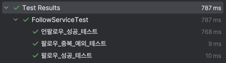

# spring-instagram-20th

CEOS 20th BE study - instagram clone coding

## 커밋 메시지

| 커밋 유형       | 의미                                 |
|-------------|------------------------------------|
| 🛠️ build   | 빌드 및 외부 종속성에 영향을 미치는 변경 ex) npm 설정 |
| 🔧 chore    | 기타 수정들 ex) .gitignore              |
| 👷 ci       | CI 설정 혹은 스크립트 추가 및 수정              |
| 💡comment   | 주석 추가/업데이트                         |
| 📝 docs     | 문서 파일 추가 및 수정 ex) readme.md        |
| ✨ feat      | 새로운 기능 추가 및 수정                     |
| 🐛 fix      | 버그 수정                              |
| 🚑 hotfix   | 긴급 수정                              |
| 🚚 move     | 파일, 경로, 라우트 등 리소스 이동 혹은 이름변경       |
| 🔖 release  | 버전 릴리즈                             |
| ♻️ refactor | 코드 리팩토링 (버그 수정/기능 추가❌)             |
| 🎨 style    | 코드의 구조 개선 (포매팅 등 / 의미를 수정하지 않음)    |
| ✅ test      | 테스트 코드 추가 및 수정                     |
| 💄 ui       | UI, 스타일 관련 파일 추가 및 수정 ex) .css     |

## 2024.11.16 Docker

### Docker란?

Docker는 애플리케이션을 컨테이너로 묶어 어디서나 동일한 환경에서 실행할 수 있도록 도와주는 도구입니다. 쉽게 말해 "애플리케이션과 필요한 설정 및 의존성을 포함한 실행 가능한 패키지"를 생성할 수 있게 합니다.

대부분의 애플리케이션 배포는 아래와 같이 실행 파일과 의존성을 일일이 설정해야 합니다.

```bash
java -jar your-application.jar
sudo apt install mysql
```

또는 운영체제별 환경 설정 차이로 문제가 생기곤 합니다. 이러한 문제를 해결하기 위해 Docker가 사용됩니다.

---

### Dockerfile이란?

Dockerfile은 Docker 컨테이너를 생성하기 위한 설정 파일입니다. 애플리케이션을 실행하기 위해 필요한 명령어와 설정을 명시해줍니다. 아래는 간단한 `Dockerfile` 예시입니다.

```dockerfile
# 1. Java 17 JDK가 포함된 이미지를 사용
FROM eclipse-temurin:17-jdk-focal

# 2. 빌드된 JAR 파일의 경로를 변수로 설정
ARG JAR_FILE=build/libs/*.jar

# 3. JAR 파일을 Docker 컨테이너 내부로 복사
COPY ${JAR_FILE} app.jar

# 4. 애플리케이션 실행 명령어
ENTRYPOINT ["java", "-jar", "-Duser.timezone=Asia/Seoul", "/app.jar"]
```

위와 같이 작성된 Dockerfile은 애플리케이션을 실행하기 위해 Java 환경을 준비하고, JAR 파일을 컨테이너에 복사하여 실행합니다.

---

### Docker 이미지 빌드하기

Dockerfile을 작성한 후, 아래 명령어로 Docker 이미지를 생성할 수 있습니다.

```bash
docker build -t instagram-project .
```

- **`-t instagram-project`**: 생성할 Docker 이미지의 이름을 지정합니다.
- **`.`**: 현재 디렉토리에 있는 Dockerfile을 사용합니다.

---

### Docker 컨테이너 실행하기

Docker 이미지를 기반으로 컨테이너를 실행하는 명령어는 다음과 같습니다.

```bash
docker run -d -p 8080:8080 --name instagram-container instagram-project
```

- **`-d`**: 컨테이너를 백그라운드에서 실행합니다.
- **`-p 8080:8080`**: 호스트의 8080 포트를 컨테이너의 8080 포트에 매핑합니다.
- **`--name instagram-container`**: 컨테이너 이름을 지정합니다.

---

## 2024.11.11 Spring Security와 로그인

## 쿠키 (Cookie)

- 쿠키는 클라이언트가 웹사이트에 접속할 때 웹서버가 브라우저에 저장하는 작은 텍스트 파일입니다. 주로 로그인 정보 등의 간단한 데이터를 저장하는 용도로 사용됩니다.
- 쿠키는 서버가 사용자를 식별하고, 매번 로그인 정보를 입력하지 않도록 합니다.
- **단점**:
    - 정보 노출 시 보안 위험이 존재하고, 데이터 조작 가능성이 있습니다.
    - 브라우저 간 호환성이 낮고, 크기 제한이 있습니다 (4KB).
    - 서버는 매번 인증 요청을 해야 합니다.

## 세션 (Session)

- 세션은 서버에 인증 정보를 저장하고, 클라이언트에 세션 ID를 쿠키 형태로 전달하는 방식으로 인증을 관리합니다.
- 세션 ID는 서버의 세션 저장소에 저장된 정보와 비교하여 사용자를 인증합니다.
- **작동 원리**:
    1. 사용자가 로그인 시 서버는 세션 ID를 생성하여 서버 세션 저장소에 저장.
    2. 세션 ID는 클라이언트에 전달되어 매번 인증 요청 시 쿠키로 전송.
    3. 서버는 세션 ID를 확인하여 인증을 완료합니다.
- **단점**:
    - 세션 저장소 장애 시 전체 인증 체계에 문제가 발생할 수 있습니다.
    - 상태 정보를 저장해야 하므로 HTTP의 장점인 stateless 속성을 잃습니다.
    - 많은 사용자가 접속할수록 메모리 사용량이 증가하고, 매 요청마다 DB 조회가 필요합니다.

## JWT (JSON Web Token)

- 세션 방식의 단점을 보완하기 위해 등장한 방식으로, 클라이언트에 직접 인증 정보를 포함한 토큰을 저장하여 stateless한 인증을 가능하게 합니다.

### JWT의 개요

- *JWT (Json Web Token)**는 토큰 기반의 인증 방식으로, 인증 정보를 암호화된 토큰에 담아 안전하게 전송하기 위해 고안된 표준입니다.
- JWT의 큰 특징은 서명된 토큰이라는 점으로, 공개/개인 키 쌍을 사용해 서명된 JWT는 서버가 이 토큰의 유효성을 검증할 수 있습니다.

### JWT의 구성 요소

JWT는 세 개의 구성 요소로 나뉘며, 각각 점(`.`)으로 구분됩니다:

- **Header**
- **Payload**
- **Signature**

**예시**: `xxxxx.yyyyy.zzzzz`

### 1. Header

```json
json
코드 복사
{
  "typ": "JWT",
  "alg": "HS512"
}

```

- **Header**에는 토큰의 타입(`typ`)과 서명에 사용된 알고리즘(`alg`)이 저장됩니다.
- 예: `JWT` 타입, `HS512` 알고리즘 사용.

### 2. Payload

```json
json
코드 복사
{
  "sub": "1",
  "iss": "ori",
  "exp": 1636989718,
  "iat": 1636987918
}

```

- **Payload**는 사용자 또는 토큰에 관한 정보인 **Claim**을 담고 있으며, key-value 형태로 구성됩니다.
- **표준 Claim** (3글자로 구성된 key 이름):
    - `iss` (Issuer): 토큰 발급자
    - `sub` (Subject): 사용자 식별값
    - `aud` (Audience): 토큰 대상자
    - `exp` (Expiration Time): 만료 시간
    - `nbf` (Not Before): 활성 시작 날짜
    - `iat` (Issued At): 발급 시간
    - `jti` (JWT ID): 토큰 식별자
- 필요에 따라 추가적인 Claim을 삽입할 수 있지만, **민감한 정보는 포함하지 않는 것이 중요**합니다.

### 3. Signature

- Signature는 토큰의 무결성을 보장하기 위해 사용됩니다. 서버는 이 서명을 통해 JWT가 변조되지 않았음을 확인합니다.

### 주의 사항

- JWT의 **Header**와 **Payload**는 특별히 암호화되지 않고 **Base64 인코딩**만 되어있기 때문에 누구나 내용을 디코딩하여 확인할 수 있습니다. 따라서 **민감한 정보는 절대
  Payload에 포함되지 않아야** 합니다.

### 장점

지금까지 쿠키와 세션을 넘어오면서 겪었던 모든 단점을 해결하는 것이 JWT인 것이기 때문에 단점들을 뒤집으면 JWT의 장점이라고 볼 수 있을 것 같습니다.

1. 이미 토큰 자체가 인증된 정보이기 때문에 세션 저장소와 같은 별도의 인증 저장소가 "필수적"으로 필요하지 않습니다.
2. 세션과는 다르게 클라이언트의 상태를 서버가 저장해두지 않아도 됩니다.
3. signature를 공통키 개인키 암호화를 통해 막아두었기 때문에 데이터에 대한 보완성이 늘어납니다.
4. 다른 서비스에 이용할 수 있는 공통적인 스펙으로써 사용할 수 있습니다.

처음 글부터 지금까지의 내용을 한 문장으로 요약하자면

> stateful해야하는 세션의 단점을 보완하기 위해 만들어진 JWT는 별도의 세션 저장소를 강제하지 않기 때문에 stateless하여 확장성이 뛰어나고, signature를 통한 보안성까지 갖추고있다.
>

### JWT의 한계점

JWT는 인증 정보를 효율적으로 전송할 수 있지만, 몇 가지 단점이 있습니다.

### 주요 단점

1. **데이터량 증가**:
    - JWT는 Base64 인코딩으로 구성되어 상대적으로 데이터량이 많아 네트워크 부하가 발생할 수 있습니다.
2. **Payload 암호화 부족**:
    - Payload는 암호화되어 있지 않기 때문에 민감한 정보를 저장할 수 없습니다. 누구나 JWT를 디코딩하여 Header와 Payload를 볼 수 있습니다.
3. **토큰 탈취 시 대처 어려움** (핵심 단점):
    - 토큰이 탈취되면 만료 시점까지 대처가 어렵습니다. 세션과 달리 서버에서 클라이언트 상태를 관리하지 않기 때문에 서버가 JWT를 끊거나 삭제할 수 없습니다.

### 해결 방법: 짧은 만료 시간 설정

- **만료 시간을 짧게** 설정하여, 만약 탈취되더라도 토큰의 유효 기간을 줄여 피해를 최소화할 수 있습니다.
- 다만, 짧은 만료 시간은 사용자의 반복 로그인으로 이어져 불편할 수 있습니다.

### 짧은 유효 시간을 보완하는 방법

짧은 만료 시간을 사용하면서 사용자 편의성을 유지하기 위해 **Sliding Session**과 **Refresh Token** 방식을 사용합니다.

### 1. Sliding Session

- 사용자가 서비스를 지속적으로 사용할 경우 **만료 시간을 연장**하여 유효성을 갱신합니다.
- 예를 들어, 사용자가 글쓰기나 결제를 진행할 때마다 만료 시간을 연장해주는 방식입니다.
- 단발성 접속에는 적용이 어렵고, 지나치게 긴 만료 시간을 설정할 경우 보안 문제가 발생할 수 있습니다.

### 2. Refresh Token

- **가장 많이 사용되는 방식**으로, Access Token과 함께 유효 기간이 긴 Refresh Token을 발급하여 Access Token 만료 시 재발급을 요청합니다.
- 예시 시나리오:
    1. 클라이언트가 서버에 ID/PW로 인증을 요청하여 Access Token과 Refresh Token을 발급받습니다.
    2. 클라이언트는 Access Token을 사용하여 서버에 요청을 하고, Refresh Token은 안전하게 저장합니다.
    3. Access Token 만료 시, 클라이언트는 Refresh Token을 이용해 서버에 새로운 Access Token을 요청합니다.
    4. 서버는 Refresh Token을 확인하고 새 Access Token을 발급하여 클라이언트에 전달합니다.

### Refresh Token Storage의 역할

- 서버는 Refresh Token을 별도의 **저장소**에 저장하여 만료된 Access Token이 다시 인증되지 않도록 합니다.
- 만약 Refresh Token이 탈취된 경우, 이 저장소를 초기화하여 탈취된 토큰을 무효화할 수 있습니다.

### I/O 작업 차이점

- **세션**: 모든 요청마다 세션 ID를 저장소와 비교해야 하므로 요청 횟수만큼 I/O가 발생합니다.
- **Refresh Token**: Access Token 만료 시에만 Refresh Token을 사용하므로 I/O 작업이 적어 효율적입니다. 예를 들어 30분 동안 1만 건의 요청이 발생하면, 세션 방식은 1만
  번 I/O가 발생하는 반면 Refresh Token 방식은 한 번의 Refresh 요청 시에만 I/O가 발생합니다.

## 2024.10.31 스프링 CRUD

## 코드 포맷터 정리

`코드 포맷터`는 코드의 형식을 정의하여`Command + Option + L`을 눌렀을 때, 포맷터에 정의한 형식에 맞게 코드를 포맷팅해준다.

또한 코드를 저장할 때마다 자동으로 작동하도록 설정할 수 있기 때문에, 일일히 객체를 찾아다니며`Command + Opton + L`을 연타할 일을 줄일 수 있다

또한, 협업을 진행하는 경우 팀원끼리 포맷팅을 맞춰두면 코드 충돌 등 에러를 많이 줄여나갈 수 있다.

### **IntelliJ 코드 포매터 등록법**

코드 포맷터를 등록하기 위해선 포맷터 파일이 있어야 한다.

- [네이버 코드 포멧터](https://github.com/naver/hackday-conventions-java/blob/master/rule-config/naver-intellij-formatter.xml)
- [구글 코드 포맷터](https://github.com/google/styleguide) (언어 선택)
- [배민(우테코) 코드 포멧터](https://github.com/woowacourse/woowacourse-docs/blob/main/styleguide/java/intellij-java-wooteco-style.xml)

등등…

기업에서 올려둔 다양한 코드 포멧터 중 원하는 것을 선택하여 적용하면 된다.

> `Settings` - `Editor` - `Code Style` - `Java` - 상단 톱니바퀴 - `Import Scheme` - `IntelliJ IDEA code style XML` - 다운로드한 파일
> import
>


### 코드 포맷팅 자동화

자동화 액션을 등록해두면, 코드를 저장할 때마다 포매터를 작동시킬 수 있다.

> `Settings` - `Tools` - `Actions on Save` → `Reformat code`, `Optimize imports` 추가
>

이를 바탕으로 코드를 저장할 때마다 사용하지 않는 import를 제거해주고, reformat code로 자동 포맷팅이 가능하다!

## 정적 팩토리 메서드를 사용하여 DTO 작성

### DTO의 중요성

### DTO의 어노테이션 이야기

[DTO에는 어떤 Annotation을 붙여야 할까?](https://velog.io/@maxgun98/DTO에는-어떤-Annotation을-붙여야-할까)

.### 정적 팩토리 메서드란?

GoF의 팩토리 패턴에서 유래된 이름으로, 말 그대로`객체를 생성하는 역할을 하는 메소드`이다.

대부분 dto -> entity로 변환을 할 때, 아래와 같이 사용한다.

```java
public ProductResponseDto toDto(Product product) {
    this.id = product.getId();
    this.name = product.getName();
    this.description = product.getDescription();
    this.stock = product.getStock();
    this.category = product.getCategory();
    this.price = product.getPrice();

    return this;
}
```

```java
public CartReadResponseDto toDto(Cart cart) {
    this.cartId = cart.getId();
    this.userId = cart.getUser()
                      .getId();
    this.cartItems = cart.getItems();
    this.totalAmounts = cart.getTotalAmounts();

    return this;
}
```

이와 같이 toDto 라는 이름을 통해서 적용해주고 있었다.

```java

@Transactional
public ProductResponseDto update(Long id, ProductRequestDto productRequestDto) {
    Product updateProduct = productRepository.findById(id)
                                             .orElseThrow(NoSuchProductExist::new);
    updateProduct.update(productRequestDto);
    return new ProductResponseDto().toDto(updateProduct);
}
```

이후 이런 식으로 new 를 통해서 새로운 dto객체를 생성하여 만들어주는 방식을 사용하고 있었다.

dto의 생성자를 만들어 주고, 이를 사용하는 static from 메소드를 생성해주었다

```jsx
@Transactional(readOnly = true)
public
CartReadResponseDto
get(Long
userId
)
{
    return CartReadResponseDto.from(cartRepository.findById(userId)
        .orElseThrow(CartNotExistException::new));
}
```

[정적 팩토리 메서드 적용 !](https://velog.io/@gnoesnooj/정적-팩토리-메서드-적용)

### 정적 팩토리 메서드 장단점

- 장점
    - 생성자와는 다르게 메소드로 객체를 생성하기 때문에 이름짓기의 자유도가 높다.

      클린 코드 원칙에 따라, 이름은 최대한 구체적으로 작성하고 있다는 점을 고려했을 때 리팩토링 여지가 있다.

        ```java
        // 생성자
        Public class Coke{
            public Coke(int sugar, int water){
                어쩌구 저쩌구..
            };
        }
        
        // 정적 팩토리 메소드
        public class Coke{
            public static Coke makeCokeBySugarAndWater(int sugar, int water){
                어쩌구 저쩌구..
            }
        }
        ```

    - 변환에 있어 내부 구조를 캡슐화할 수 있다.

      DTO변환 시 정적팩토리메소드를 사용한다면 from이나 of(외부객체를 해당 객체로 변환)를 사용하기만 하면 되지만, 인스턴스 메소드 사용시 생성자 자체와 그의 내부를 전부 노출시키게 된다.

        ```java
        // 인스턴스 메소드 사용시
        CarDto carDto = new CarDto(car.getCarName,car.getCarDistance)
        
        // 정적 팩토리 메소드 사용시
         CarDto carDto = CarDto.from(car)
        ```

- 단점
    - 상속 불가능

      정적 팩토리 메서드를 사용할 시 생성자는 접근제어자가 private으로 한정되어 있기 때문에 해당 클래스는 부모 클래스가 될 수 없다. (근데 역으로 생각하면 생성자 제어 할 수 있어서 오히려 좋은 경우도
      있습니다.)

    - 생성자를 찾기가 쉽지 않다.

      인스턴스 클래스라면 포멧이 생성자, 메소드1, 메소드2 이런식으로 가는데, 정적 팩토리 메서드를 쓰면 생성자도 일반적인 메소드와 같은 형식이여서 상대적으로 찾기가 좀 어렵다.

### 정적 팩토리 메서드 네이밍 규칙

- from : 하나의 매개 변수를 받아서 객체를 생성
- of : 여러개의 매개 변수를 받아서 객체를 생성
- valueOf : from 과 of 보다 자세하게 사용
- getInstance | instance : 인스턴스를 생성. 이전에 반환했던 것과 같을 수 있음.
- newInstance | create : 새로운 인스턴스를 생성
- get[OtherType] : 다른 타입의 인스턴스를 생성. 이전에 반환했던 것과 같을 수 있음.
- new[OtherType] : 다른 타입의 새로운 인스턴스를 생성.

## Global Exception : 예외 처리 알아보기

[Spring: 예외 처리 - 쉽게 관심사 나누기 Global Exception Handler(Controller Advice)](https://velog.io/@letsdev/Spring-예외-처리-쉽게-관심사-나누기-Global-Exception-HandlerController-Advice)

## 클린 코드란 무엇일까? 반영해보기

### 이름을 통해 의도를 드러낸다

나 자신, 다른 개발자와의 소통을 위해 가장 중요한 활동 중의 하나가 좋은 이름 짓기이다. 변수 이름, 함수(메서드) 이름, 클래스 이름을 짓는데 시간을 투자하라. 이름을 통해 변수의 역할, 함수의 역할, 클래스의
역할에 대한 의도를 드러내기 위해 노력하라. 연속된 숫자를 덧붙이거나(a1, a2, ..., aN), 불용어(Info, Data, a, an, the)를 추가하는 방식은 적절하지 못하다.

### 축약하지 않는다

의도를 드러낼 수 있다면 이름이 길어져도 괜찮다.

누구나 실은 클래스, 메서드, 또는 변수의 이름을 줄이려는 유혹에 곧잘 빠지곤 한다. 그런 유혹을 뿌리쳐라. 축약은 혼란을 야기하며, 더 큰 문제를 숨기는 경향이 있다. 클래스와 메서드 이름을 한 두 단어로
유지하려고 노력하고 문맥을 중복하는 이름을 자제하자. 클래스 이름이 Order라면 shipOrder라고 메서드 이름을 지을 필요가 없다. 짧게 ship()이라고 하면 클라이언트에서는 order.ship()라고
호출하며, 간결한 호출의 표현이 된다. 객체 지향 생활 체조 원칙 5: 줄여쓰지 않는다 (축약 금지)

### 공백도 코딩 컨벤션이다

if, for, while문 사이의 공백도 코딩 컨벤션이다.

### 공백 라인을 의미 있게 사용한다

공백 라인을 의미 있게 사용하는 것이 좋아 보이며, 문맥을 분리하는 부분에 사용하는 것이 좋다. 과도한 공백은 다른 개발자에게 의문을 줄 수 있다.

### space와 tab을 혼용하지 않는다

들여쓰기에 space와 tab을 혼용하지 않는다. 둘 중에 하나만 사용한다. 확신이 서지 않으면 pull request를 보낸 후 들여쓰기가 잘 되어 있는지 확인하는 습관을 들인다.

### 의미 없는 주석을 달지 않는다

변수 이름, 함수(메서드) 이름을 통해 어떤 의도인지가 드러난다면 굳이 주석을 달지 않는다. 모든 변수와 함수에 주석을 달기보다 가능하면 이름을 통해 의도를 드러내고, 의도를 드러내기 힘든 경우 주석을 다는 연습을
한다.

### IDE의 코드 자동 정렬 기능을 활용한다

IDE의 코드 자동 정렬 기능을 사용하면 더 깔끔한 코드를 볼 수 있다.

- IntelliJ IDEA: ⌥⌘L, Ctrl+Alt+L
- Eclipse: ⇧⌘F, Ctrl+Shift+F

### Java에서 제공하는 API를 적극 활용한다

함수(메서드)를 직접 구현하기 전에 Java API에서 제공하는 기능인지 검색을 먼저 해본다.

Java API에서 제공하지 않을 경우 직접 구현한다.

예를 들어 사용자를 출력할 때 사용자가 2명 이상이면 쉼표(,) 기준으로 출력을 위한 문자열은 다음과 같이 구현 가능하다.

List<String> members = Arrays.asList("pobi", "jason");

### README.md를 상세히 작성한다

README.md는 소스코드에 앞서 해당 프로젝트가 어떠한 프로젝트인지 **마크다운**으로 작성하여 소개하는 문서이다. 해당 프로젝트가 어떠한 프로젝트이며, 어떤 기능을 담고 있는지 기술하기 위해서 마크다운 문법을
검색해서 학습해 보고 적용해 본다.

### 기능 목록을 재검토한다

기능 목록을 클래스 설계와 구현, 함수(메서드) 설계와 구현과 같이 너무 상세하게 작성하지 않는다. 클래스 이름, 함수(메서드) 시그니처와 반환값은 언제든지 변경될 수 있기 때문이다. 너무 세세한 부분까지
정리하기보다 구현해야 할 기능 목록을 정리하는 데 집중한다. **정상적인 경우도 중요하지만, 예외적인 상황도 기능 목록에 정리**한다. 특히 예외 상황은 시작 단계에서 모두 찾기 힘들기 때문에 기능을 구현하면서
계속해서 추가해 나간다.

### 기능 목록을 업데이트한다

README.md 파일에 작성하는 기능 목록은 기능 구현을 하면서 변경될 수 있다. 시작할 때 모든 기능 목록을 완벽하게 정리해야 한다는 부담을 가지기보다 기능을 구현하면서 문서를 계속 업데이트한다. 죽은 문서가
아니라 살아있는 문서를 만들기 위해 노력한다.

### 값을 하드 코딩하지 않는다

문자열, 숫자 등의 값을 하드 코딩하지 마라. 상수(static final)를 만들고 이름을 부여해 이 변수의 역할이 무엇인지 의도를 드러내라. 구글에서 "java 상수"와 같은 키워드로 검색해 상수 구현 방법을
학습하고 적용해 본다.

### 배열 대신 Java Collection을 사용한다

Java Collection 자료구조(List, Set, Map 등)를 사용하면 데이터를 조작할 때 다양한 API를 사용할 수 있다.

예를 들어 List<String>에 "pobi"라는 값이 포함되어 있는지는 다음과 같이 확인할 수 있다.

List<String> members = Arrays.asList("pobi", "jason");

### 구현 순서도 코딩 컨벤션이다

클래스는 상수, 멤버 변수, 생성자, 메서드 순으로 작성한다.

```java
class A {
    상수(static final) 또는 클래스 변수

    인스턴스 변수

    생성자

            메서드
}
```

### 변수 이름에 자료형은 사용하지 않는다

변수 이름에 자료형, 자료 구조 등을 사용하지 마라.

`String carNameList = Console.readLine();`

### 한 함수가 한 가지 기능만 담당하게 한다

함수 길이가 길어진다면 한 함수에서 여러 일을 하려고 하는 경우일 가능성이 높다. 아래와 같이 한 함수에서 안내 문구 출력, 사용자 입력, 유효값 검증 등 여러 일을 하고 있다면 이를 적절하게 분리한다

```java
public List<String> userInput() {
    System.out.println("경주할 자동차 이름을 입력하세요(이름은 쉼표(,)를 기준으로 구분).");
    String userInput = Console.readLine()
                              .trim();
    String[] splittedName = userInput.split(",");
    for (int index = 0; index < splittedName.length; index++) {
        if (splittedName.length < 1 || splittedName.length > 5) {
            throw new IllegalArgumentException("[ERROR] 자동차 이름은 1자 이상 5자 이하만 가능합니다.");
        }
    }
    return Arrays.asList(splittedName);
}
```

### 함수가 한 가지 기능을 하는지 확인하는 기준을 세운다

만약 여러 함수에서 중복되어 사용되는 코드가 있다면 함수 분리를 고민해 본다. 또한, 함수의 길이를 15라인을 넘어가지 않도록 구현하며 함수를 분리하는 의식적인 연습을 할 수 있다.

### 함수(메서드) 라인에 대한 기준

프로그래밍 요구사항을 보면 함수 15라인으로 제한하는 요구사항이 있다. 이 기준은 **main()** 함수에도 해당된다. 공백 라인도 한 라인에 해당한다. 15라인이 넘어간다면 함수 분리를 위한 고민을 한다.

### 발생할 수 있는 예외 상황에 대해 고민한다

정상적인 경우를 구현하는 것보다 예외 상황을 모두 고려해 프로그래밍하는 것이 더 어렵다. 예외 상황을 고려해 프로그래밍하는 습관을 들인다. 예를 들어 로또 미션의 경우 아래와 같은 예외 상황을 고민해 보고 해당
예외에 대해 처리를 할 수 있어야 한다.

- 로또 구입 금액에 1000 이하의 숫자를 입력
- 당첨 번호에 중복된 숫자를 입력
- 당첨 번호에 1~45 범위를 벗어나는 숫자를 입력
- 당첨 번호와 중복된 보너스 번호를 입력

### 비즈니스 로직과 UI 로직을 분리한다

비즈니스 로직과 UI 로직을 한 클래스가 담당하지 않도록 한다. 단일 책임의 원칙에도 위배된다.

```java
public class Lotto {
    private List<Integer> numbers;

    // 로또 숫자가 포함되어 있는지 확인하는 비즈니스 로직
    public boolean contains(int number) {
        ...
    }

    // UI 로직
    private void print() {
        ...
    }
}
```

현재 객체의 상태를 보기 위한 로그 메시지 성격이 강하다면 **toString()**을 통해 구현한다. View에서 사용할 데이터라면 getter 메서드를 통해 데이터를 전달한다.

### **연관성이 있는 상수는 static final 대신 enum을 활용한다**

```java
public enum Rank {
    FIRST(6, 2_000_000_000),
    SECOND(5, 30_000_000),
    THIRD(5, 1_500_000),
    FOURTH(4, 50_000),
    FIFTH(3, 5_000),
    MISS(0, 0);

    private int countOfMatch;
    private int winningMoney;

    private Rank(int countOfMatch, int winningMoney) {
        this.countOfMatch = countOfMatch;
        this.winningMoney = winningMoney;
    }
}
```

### final 키워드를 사용해 값의 변경을 막는다

최근에 등장하는 프로그래밍 언어들은 기본이 불변 값이다. 자바는 **final** 키워드를 활용해 값의 변경을 막을 수 있다.

```java
public class Money {
    private final int amount;

    public Money(int amount) {
        ...
    }
}
```

### 객체의 상태 접근을 제한한다

인스턴스 변수의 접근 제어자는 private으로 구현한다.

```java
public class WinningLotto {
    private Lotto lotto;
    private Integer bonusNumber;

    public WinningLotto(Lotto lotto, Integer bonusNumber) {
        this.lotto = lotto;
        this.bonusNumber = bonusNumber;
    }
}
```

### 객체는 객체스럽게 사용한다

**Lotto** 클래스는 **numbers**를 상태 값으로 가지는 객체이다. 그런데 이 객체는 로직에 대한 구현은 하나도 없고, **numbers**에 대한 getter 메서드만을 가진다.

```java
public class Lotto {
    private final List<Integer> numbers;

    public Lotto(List<Integer> numbers) {
        this.numbers = numbers;
    }

    public int getNumbers() {
        return numbers;
    }
}

public class LottoGame {
    public void play() {
        Lotto lotto = new Lotto(...);

        // 숫자가 포함되어 있는지 확인한다.
        lotto.getNumbers()
             .contains(number);

        // 당첨 번호와 몇 개가 일치하는지 확인한다.
        lotto.getNumbers()
             .stream()...
    }
}
```

**Lotto**에서 데이터를 꺼내지(get) 말고 메시지를 던지도록 구조를 바꿔 데이터를 가지는 객체가 일하도록 한다.

```java
public class Lotto {
    private final List<Integer> numbers;

    public boolean contains(int number) {
        // 숫자가 포함되어 있는지 확인한다.
        ...
    }

    public int matchCount(Lotto other) {
        // 당첨 번호와 몇 개가 일치하는지 확인한다.
        ...
    }
}

public class LottoGame {
    public void play() {
        Lotto lotto = new Lotto(...);
        lotto.contains(number);
        lotto.matchCount(...);
    }
}
```

(**참고**. [getter를 사용하는 대신 객체에 메시지를 보내자](https://tecoble.techcourse.co.kr/post/2020-04-28-ask-instead-of-getter/))

### 필드(인스턴스 변수)의 수를 줄이기 위해 노력한다

필드(인스턴스 변수)의 수가 많은 것은 객체의 복잡도를 높이고, 버그 발생 가능성을 높일 수 있다. 필드에 중복이 있거나, 불필요한 필드가 없는지 확인해 필드의 수를 최소화한다.

예를 들어 총상금 및 수익률을 구하는 다음 객체를 보자.

```java
public class LottoResult {
    private Map<Rank, Integer> result = new HashMap<>();
    private double profitRate;
    private int totalPrize;
}
```

위 객체의 **profitRate**와 **totalPrize**는 등수 별 당첨 내역(**result**)만 있어도 모두 구할 수 있는 값이다. 따라서 위 객체는 다음과 같이 하나의 필드만으로 구현할 수 있다.

```java
public class LottoResult {
    private Map<Rank, Integer> result = new HashMap<>();

    public double calculateProfitRate() { ...}

    public int calculateTotalPrize() { ...}
}
```

## 2024.09.23 JPA 심화

### 0️⃣ 기존 Domain 수정

### - 필요한 필드 추가

멤버 엔티티에 성별 정보를 추가해주었다.

`@Enumerated(EnumType.*STRING*)
private Gender gender;`

```python
@Getter
@AllArgsConstructor
public enum Gender {
    FEMALE("여자"),
    MALE("남자"),
    UNKNOWN("불명");

    private final String description;
}
```

### - 어노테이션 수정

```python
public class Member extends BaseEntity {

    @Id
    @GeneratedValue(strategy = GenerationType.IDENTITY)
    @Column(name = "member_id", nullable = false)
    private Long id;

    @Column(length = 13, nullable = false)
    private String phone;

    @Column(length = 200, nullable = false)
    private String email;

    @Column(length = 200, nullable = false)
    private String password;

    @Column(length = 20, nullable = false)
    private String name;

    @Column(length = 50, nullable = false)
    private String nickname;

    @Column(length = 200)
    private String introduction;
```

`@Column` 어노테이션의 경우, 특별한 옵션 지정이 필요하지 않은 경우 생략해도 된다는 점을 저번시간 세션을 통해 알았다. 또한, 아직 설계 단계이기때문에 구체적인 length를 지정해주는 것이 큰 의미가 없을
수 있다고 판단하여 옵션은 잠시 수정해두었다. 이후, nullable 대신 `@Notnull`어노테이션을 사용하는 것이 더 효율적일 수 있다는 점을 바탕으로 어노테이션을 수정해주었다.

```python
public class Member extends BaseEntity {

    @Id
    @GeneratedValue(strategy = GenerationType.IDENTITY)
    @Column(name = "member_id", nullable = false)
    private Long id;

    @NonNull
    private String phone;

    @NonNull
    private String email;

    @NonNull
    private String password;

    @NonNull
    private String name;

    @NonNull
    private String nickname;

    private String introduction;

    private Timestamp birth;
```

또한, 생성자와 관련된 어노테이션도 수정해주었다.

```python
@Entity
@Getter
@NoArgsConstructor(access = AccessLevel.PROTECTED) // 매개변수가 없는 기본 생성자 (JPA의 프록시 객체를 위해)
public class Member extends BaseEntity
```

기존에는 다음과 같은 생성자만을 달아주어서, 멤버 엔티티의 테스트코드 작성을 위해 직접 생성자를 만드는 등 귀찮은 작업을 해주었다.

어노테이션은 정확한 기능을 파악하고, 필요한 어노테이션을 적절하게 사용할 수 있는 능력이 중요하다고 판단하여 이 점을 고려하여 관련 공부를 해보았다.

- **어떤 어노테이션을 사용하는 것이 좋을까?**

  `Member` 엔티티와 같은 경우 다음과 같이 선택할 수 있다

    - **반드시 필요한 기본 생성자**: `@NoArgsConstructor(access = AccessLevel.PROTECTED)`는 JPA에서 엔티티 관리를 위해 필요하며, `protected`로 생성하면
      외부에서 임의로 객체를 생성하지 못하게 해 엔티티의 무결성을 유지할 수 있습니다.
    - **유연하고 안전한 객체 생성**: `@Builder`를 사용하는 것이 가장 유연하며 가독성 높은 객체 생성이 가능합니다. 빌더 패턴은 필드가 많거나 선택적 초기화가 필요할 때 매우 유용하므로, 엔티티
      객체 생성 시 자주 사용됩니다.
    - **모든 필드 초기화가 필요한 경우**: `@AllArgsConstructor`는 모든 필드 초기화가 필요한 특정 상황에서만 사용하고, 일반적으로는 `@Builder`를 활용하는 것이 더 안전하고
      편리합니다.

  따라서, 일반적인 `Member` 엔티티의 경우 `@NoArgsConstructor(access = AccessLevel.PROTECTED)`와 `@Builder`를 함께 사용하는 것이 가장 좋습니다. 이는
  JPA의 요구사항을 충족하면서도 가독성 있고 안전하게 객체를 생성할 수 있는 구조입니다.

하지만, `@NoArgsConstructor(access = AccessLevel.PROTECTED)`와 `@Builder`를 함께 사용하면 오류가 발생했고, 이는 모든 필드를 받는 생성자가 없어서임을 다시
확인했다. (게시글 참조)

[@NoargsConstructor(AccessLevel.PROTECTED) 와 @Builder](https://cobbybb.tistory.com/14)

따라서 밑의 세 어노테이션을 기본으로 사용하고, 빌더 패턴을 통해 유연하게 수정할 필요가 없는 엔티티의 경우 `@NoArgsConstructor(access = AccessLevel.PROTECTED)`만을
사용하도록 코드를 수정해주었다.

```python
@NoArgsConstructor(access = AccessLevel.PROTECTED)
@AllArgsConstructor
@Builder
```

### - 불필요한 양방향 연관관계 삭제

이전 과제에서는 모든 연관관계를 양방향 연관관계로 설정해서 도메인이 매우 복잡해졌다. 이번 과제에서는 그러한 연관관계가 왜 불편한지, 그리고 어떠한 문제를 가지고 있는지 먼저 파악해보았고, 그러한 불필요한 연관관계를
제거하여 도메인을 조금 더 깔끔하게 구성할 수 있었다.

1. **양방향 연관관계의 데이터 로딩 문제**

예를 들어, `Member`와 `Post`가 양방향 연관관계라고 가정해보자.

```java
// Member 엔티티
@OneToMany(mappedBy = "member")
private List<Post> posts;

// Post 엔티티
@ManyToOne
private Member member;

```

만약 `Member`를 조회할 때마다 해당 멤버가 작성한 모든 게시물을 가져와야 한다면, `posts` 연관관계가 유용할 수 있다. 그러나 모든 `Member` 조회 시 자동으로 그와 관련된 `Post` 리스트까지
로딩된다면, 불필요한 데이터가 많이 로딩되어 성능 문제가 발생할 수 있다. 특히 사용자가 많은 경우 `Member` 한 명을 조회할 때마다 관련된 `Post`를 매번 가져오게 되면 데이터베이스 쿼리의 효율이 떨어지게
될 것이다.

2. **순환 참조 문제 (N+1 문제)**

양방향 연관관계는 순환 참조로 인해 N+1 문제를 일으킬 수 있다.

만약 `Member`와 `Comment`가 양방향 연관관계로 연결되어 있다면, `Member` 조회 시 `Comment`를 로딩하는데, 만약 한 `Member`가 10개의 `Comment`를 가지고 있다면 첫 번째
쿼리로 `Member`를 가져오고, 두 번째부터는 각 `Comment`를 가져오는 총 11번의 쿼리가 실행될 수 있다. 이것이 바로 N+1 문제이고, 이렇게 불필요하게 많은 쿼리가 실행되면서 애플리케이션의 성능을
크게 저하시키게 된다.

따라서 양방향 관계를 제거하고 단방향 관계로 구성하면 순환 참조의 위험을 피할 수 있다. 예를 들어 `Comment`에서 `Member`를 참조하는 단방향 관계로만 유지하면, `Member` 조회
시에는 `Comment`와 관련된 쿼리를 실행하지 않게 된다.

3. **유지보수성과 복잡도 감소**

양방향 연관관계는 코드의 복잡도를 높여 유지보수성이 떨어질 수 있다.

`Follow` 엔티티를 생각해보자. `Member`가 팔로우하는 사람과 팔로워 관계를 모두 양방향으로 구성하면, `Follow` 추가나 삭제 시 `Member`의 `followings`와 `followers`
리스트를 모두 관리해줘야 한다. 이는 코드의 복잡도를 높이고 에러의 원인이 될 수 있어요.

단방향 연관관계로만 구성하여 `Follow` 엔티티에서만 `follower`와 `following`을 참조하게 하면, 엔티티의 상태를 단순하게 유지할 수 있고, 한 방향에서만 관리하면 되기 때문에 유지보수성이
높아진다.

## 1️⃣ 인스타그램 서비스 코드 작성

모든 서비스코드를 작성하지는 못했고, 기본적으로 자주 사용하며 필수적이라 판단한 서비스 코드 위주로 작성하였다.

### - 멤버 서비스 코드

- MemberRepository 수정
    - 기존 JPA repositrory를 사용하지 않고 직접 구현했던 MemberRepositoryImple 클래스를 삭제하고, 다시 수정해주었다.

        ```java
        public interface MemberRepository extends JpaRepository<Member, Long> {
            Optional<Member> findMemberById(Long id);
        
            Optional<Member> findByNickname(String name);
        
            Boolean existsByEmail(String email);
        
            Boolean existsByNickname(String nickname);
        }
        ```

    - 로그인을 위해 필요한 기본적인 리포지토리 코드를 추가해주었다.
- Service 어노테이션 확인

    ```java
    @Service
    @Transactional
    @RequiredArgsConstructor
    public class MemberService {
        private final MemberRepository memberRepository;
    }
    ```

  시작에 앞서, 기본적인 어노테이션의 의미를 먼저 짚고 가보자!

    1. **`@Service`**

    - `@Service`는 해당 클래스가 **서비스 레이어**를 담당한다는 것을 명시하는 어노테이션이에요. 이는 컨트롤러에서 비즈니스 로직을 처리하거나 데이터베이스와 상호작용하기 위한 작업들을 수행하는 클래스에
      사용됩니다.
    - `@Component`와 같은 역할을 하며, 빈(Bean)으로 스프링 컨텍스트에 등록되어 의존성 주입을 통해 다른 곳에서 사용할 수 있어요.
    - `@Service`를 명시적으로 사용하면 코드 가독성이 향상되고, 해당 클래스가 **서비스 역할을 담당하는지 구분하기** 쉬워집니다.
    - **언제 사용하나?**:
        - 일반적으로 비즈니스 로직을 처리하고, 트랜잭션 처리를 위한 서비스 클래스에서 사용합니다.

    2. **`@Transactional`**

    - `@Transactional`은 **트랜잭션을 관리**하기 위해 사용하는 어노테이션으로, 메서드나 클래스에 붙여주면 그 안의 로직이 모두 하나의 트랜잭션으로 실행됩니다.
    - **트랜잭션의 시작과 커밋/롤백을 관리**하며, 메서드 실행 중에 오류가 발생하면 자동으로 롤백시켜 데이터의 일관성을 유지해줍니다.
    - 클래스에 붙이면 해당 클래스의 **모든 public 메서드**에 트랜잭션이 적용되고, 메서드에 붙이면 해당 메서드에만 적용됩니다.
    - **어떤 상황에서 쓰는 게 좋을까?**:
        - 데이터베이스를 읽고 쓰는 모든 서비스 로직에 적용하며, 특히 여러 DAO나 리포지토리 간의 복잡한 작업을 하나의 트랜잭션으로 묶을 때 유용합니다.

    3. **`@RequiredArgsConstructor` (Lombok)**

    - `@RequiredArgsConstructor`는 **Lombok** 어노테이션으로, 클래스에 있는 모든 `final` 필드나 `@NonNull`로 선언된 필드들을 매개변수로 받는 **생성자를 자동으로
      생성**해 줍니다.
    - 이렇게 생성된 생성자는 **의존성 주입**을 쉽게 해주는데요, 스프링에서 주로 사용되는 **생성자 주입** 방식을 편리하게 만들어줍니다.
    - 코드를 줄이면서도 생성자 주입을 안전하고 편리하게 사용할 수 있게 도와줍니다.

      ```java
      public MemberService(MemberRepository memberRepository) {
          this.memberRepository = memberRepository;
      }
      ```

    - 위의 생성자를 자동으로 만들어 주기 때문에 `@RequiredArgsConstructor`를 사용하면 해당 코드를 생략할 수 있습니다.
    - **왜 사용하는 게 좋을까?**:
        - 생성자 주입을 통해 의존성을 주입하는 방식을 간결하게 사용할 수 있고, `final` 필드로 의존성을 선언함으로써 **불변성**을 보장할 수 있습니다.

해당 어노테이션들을 바탕으로, 인스타그램에 기본적으로 필요한 서비스 로직을 작성해보자.

참고로, JPA 리포지토리는 기본적으로 findAll, findAllById, findById, exists, count, save 등의 함수를 확장하고 있기 때문에 해당 함수는 따로 만들어주지 않아도 괜찮다.

아직 DTO 클래스를 작성하지 않았기 때문에, 매개변수로는 직접 필드를 추가해주고, 추후 수정해줄 예정이다.

- 서비스 간 역할 분리 원칙

  참고로, 서비스 간 역할 분리와 의존성 관리를 위해 한 클래스의 서비스에서 다른 클래스의 레포지토리를 직접 가져오지 않았다.

    ```java
    public class PostService {
        private final PostRepository postRepository;
        private final MemberRepository memberRepository;
    ```

  서비스는 보통 특정 도메인에 대한 비즈니스 로직을 처리하도록 설계됩니다. 만약 `MemberService`에서 `PostRepository`를 직접 가져오게 되면, `MemberService`가 **Member
  ** 뿐만 아니라 **Post**에 대한 로직도 알게 되므로 역할이 모호해집니다.

  이로 인해 서비스 간의 의존성이 높아지고, 각 서비스의 역할이 분리되지 않아 유지보수 및 확장이 어려워집니다.

  **서비스 레이어는 레포지토리와 직접 상호작용하되, 다른 도메인의 비즈니스 로직은 해당 도메인의 서비스에 위임하는 것이 좋습니다**. 이렇게 하면 레포지토리와의 직접적인 상호작용이 최소화되고, 비즈니스 로직이
  도메인별로 명확하게 분리됩니다.

  예를 들어 `CommentService`에서 `Member`를 조회해야 한다면 `MemberRepository`를 직접 호출하지 말고, **`MemberService`의 메서드를 호출하여** 필요한 비즈니스
  로직을 처리하도록 해야 합니다.

  다음의 원칙을 고려하며 코드를 작성했다.

- Service 구현 로직

  다음의 기능을 구현하였고, 구체적인 코드는 레포를 통해 확인하길 바란다!

    - 회원 가입

      멤버 엔티티에서 가장 기본적인 비즈니스 로직은 회원 가입과 회원 조회라고 판단했다. 추후 필요한 로직이 있다면 수정할 예정.

    - 회원 조회
    - 회원 여부 조회

---

이후 멤버와 비슷한 방식으로 리포지토리를 작성하고, 서비스 로직을 짜주었다.

### - 게시글 서비스 코드

### - 댓글 서비스 코드

### - 팔로우 서비스 코드

### - DM 서비스 코드

## 2️⃣ Repository 계층의 테스트를 진행


## 3️⃣ Service 계층의 테스트를 진행

### PostServiceTest


### CommentServiceTest


### FollowServiceTest


---

## 2024.09.09 DB 모델링 및 JPA

### 인스타그램의 DB를 모델링해요

- 과제의 주제는 [인스타그램](https://www.instagram.com/) **데이터 모델링** 해보기!
    - 게시글 조회
    - 게시글에 사진과 함께 글 작성하기
    - 게시글에 댓글 및 대댓글 기능
    - 게시글에 좋아요 기능
    - 게시글, 댓글, 좋아요 삭제 기능
    - 유저 간 1:1 DM 기능


- 회원가입은 전화번호 or 이메일로 본인인증을 거친다.
- 본인인증 후 이름, 비밀번호를 입력한다.(비밀번호는 6자 이상, 숫자/영문/특수기호 포함)
- 생일을 추가하면 회원가입 완료(만 14세 이상을 확인, 광고 개인화 등의 목적을 가짐)
- 회원끼리는 팔로워 - 팔로잉 관계가 존재한다.
- (프로필사진, 이름, 닉네임, 웹사이트, 소개) 는**'오픈 프로필'**에 해당, (이메일, 전화번호, 생일) 은**'개인정보'**에 해당. 이 중**사용자 이름, 전화번호만 필수항목**
  
- 게시물 작성에는 (본문, 회원태그, 위치, 이미지들) 이 포함된다.('다른 미디어에도 게시', '고급 설정' 기능은 배제)
- 게시물 작성 - 사람 태그하기에서는 닉네임으로 검색하여 일치하는 회원을 보여주고, 선택할 수 있다. 태그는 여러 회원을 지정할 수 있다.
- 게시물 작성 - 위치 태그에서는 검색어와 일치하는 장소를 보여주고, 선택할 수 있다.(일단은 정확한 위치가 아니더라도 텍스트로 입력할 수 있게만 구현)
- 노출되는 게시물에는 (프로필사진, 닉네임, 게시물 첫 번째 이미지, 좋아요 수, 본문, 사람태그, 위치, 해시태그들) 이 포함된다.
- 좋아요에는 좋아요를 누른 회원들의 (프로필사진, 닉네임, 이름, 팔로우/팔로잉 여부) 가 포함된다.(팔로잉 중이라면 '팔로잉', 아니라면 '팔로우' 버튼으로 보임)
- 활동에서는 '좋아요' 활동만 구현. 좋아요의 생성일자를 기준으로 오늘, 이번 주, 이번 달에 해당하는 활동을 보여준다.('회원님이 알 수도 있는', '~님이 사진 ~장을 공유했습니다' 등의 소식형 활동 일단
  배제)
  
- 게시물 본문을 클릭 시 본문과 댓글이 보인다.
- 댓글에는 (프로필사진, 닉네임, 댓글내용, 태그된 유저, 댓글 좋아요, 대댓글 여부) 가 포함된다.
  
- 채팅방에는 대화를 나누는 유저들이 메시지를 전송한다
- 채팅방 리스트에서 마지막에 보낸 메시지를 볼 수 있다.
