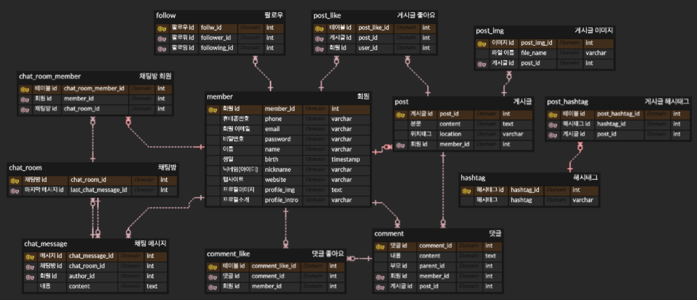
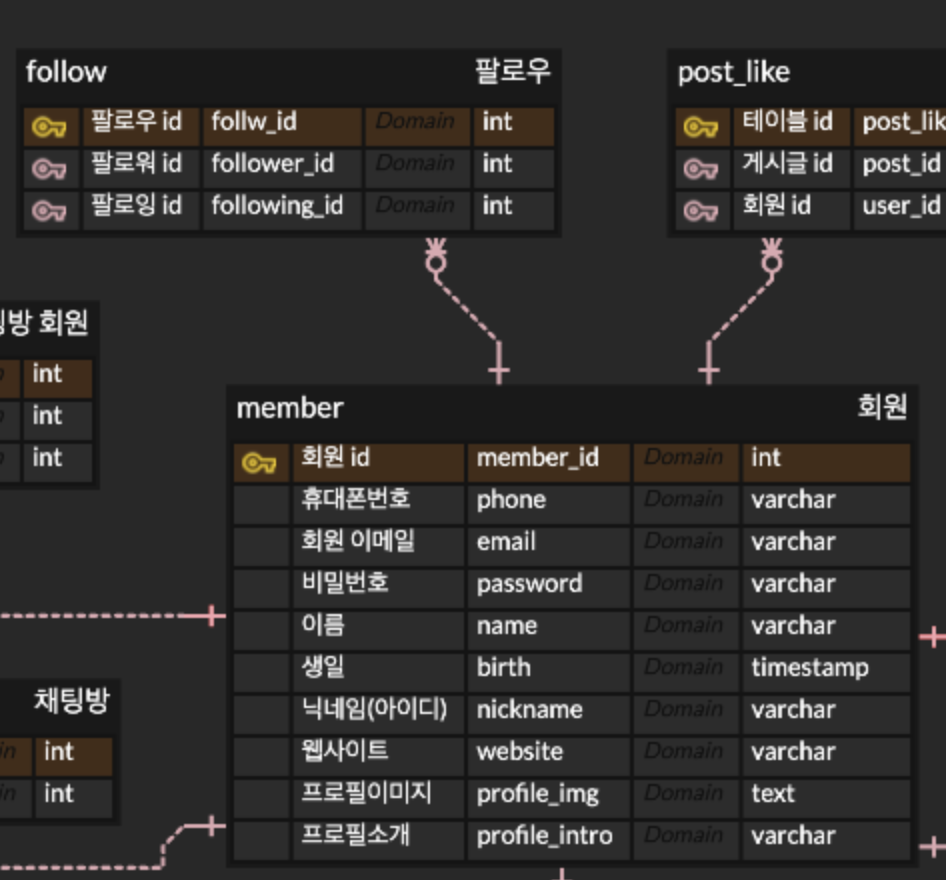
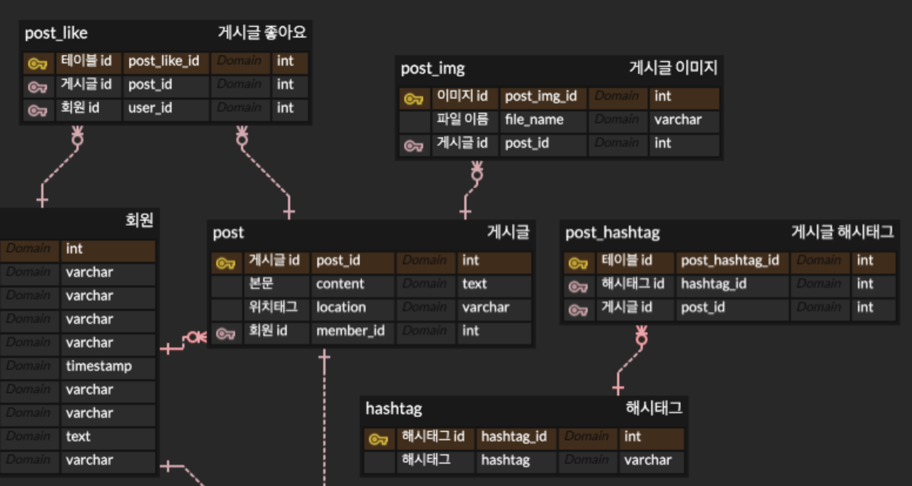
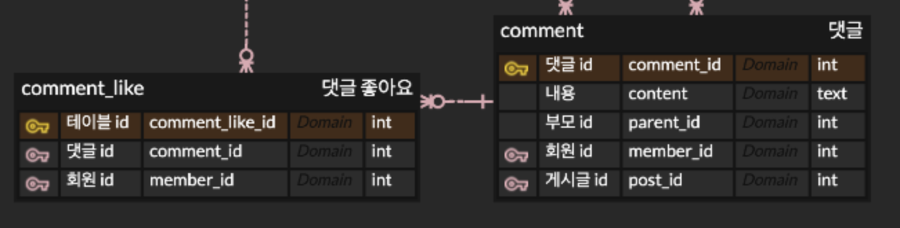
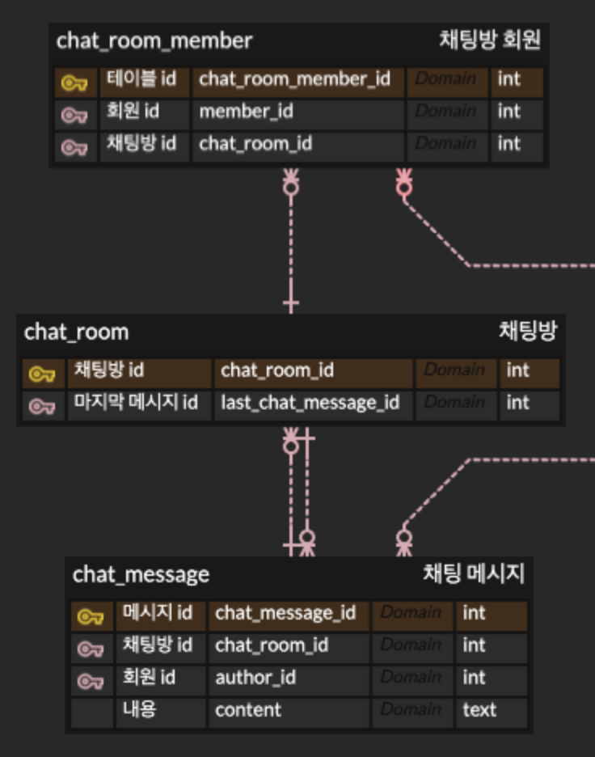

# spring-instagram-20th
CEOS 20th BE study - instagram clone coding 

### 인스타그램의 DB를 모델링해요

- 과제의 주제는 [인스타그램](https://www.instagram.com/) **데이터 모델링** 해보기!
    - 게시글 조회
    - 게시글에 사진과 함께 글 작성하기
    - 게시글에 댓글 및 대댓글 기능
    - 게시글에 좋아요 기능
    - 게시글, 댓글, 좋아요 삭제 기능
    - 유저 간 1:1 DM 기능

- 회원가입은 전화번호 or 이메일로 본인인증을 거친다.
- 본인인증 후 이름, 비밀번호를 입력한다. (비밀번호는 6자 이상, 숫자/영문/특수기호 포함)
- 생일을 추가하면 회원가입 완료 (만 14세 이상을 확인, 광고 개인화 등의 목적을 가짐)
- 회원끼리는 팔로워 - 팔로잉 관계가 존재한다.
- (프로필사진, 이름, 닉네임, 웹사이트, 소개) 는 **'오픈 프로필'** 에 해당, (이메일, 전화번호, 생일) 은 **'개인정보'** 에 해당. 이 중 **사용자 이름, 전화번호만 필수항목**

- 게시물 작성에는 (본문, 회원태그, 위치, 이미지들) 이 포함된다. ('다른 미디어에도 게시', '고급 설정' 기능은 배제)
- 게시물 작성 - 사람 태그하기에서는 닉네임으로 검색하여 일치하는 회원을 보여주고, 선택할 수 있다. 태그는 여러 회원을 지정할 수 있다.
- 게시물 작성 - 위치 태그에서는 검색어와 일치하는 장소를 보여주고, 선택할 수 있다. (일단은 정확한 위치가 아니더라도 텍스트로 입력할 수 있게만 구현)
- 노출되는 게시물에는 (프로필사진, 닉네임, 게시물 첫 번째 이미지, 좋아요 수, 본문, 사람태그, 위치, 해시태그들) 이 포함된다.
- 좋아요에는 좋아요를 누른 회원들의 (프로필사진, 닉네임, 이름, 팔로우/팔로잉 여부) 가 포함된다. (팔로잉 중이라면 '팔로잉', 아니라면 '팔로우' 버튼으로 보임)
- 활동에서는 '좋아요' 활동만 구현. 좋아요의 생성일자를 기준으로 오늘, 이번 주, 이번 달에 해당하는 활동을 보여준다. ('회원님이 알 수도 있는', '~님이 사진 ~장을 공유했습니다' 등의 소식형 활동 일단 배제)

- 게시물 본문을 클릭 시 본문과 댓글이 보인다.
- 댓글에는 (프로필사진, 닉네임, 댓글내용, 태그된 유저, 댓글 좋아요, 대댓글 여부) 가 포함된다.

- 채팅방에는 대화를 나누는 유저들이 메시지를 전송한다
- 채팅방 리스트에서 마지막에 보낸 메시지를 볼 수 있다.
