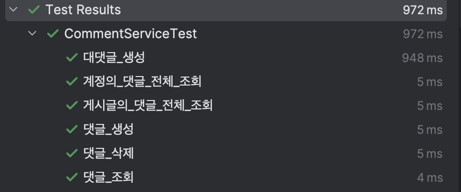
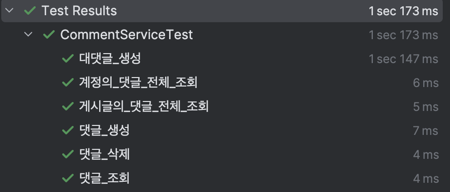

# spring-instagram-20th
CEOS 20th BE study - instagram clone coding 

## 2024.09.23 JPA 심화
### 0️⃣ 기존 Domain 수정

### - 필요한 필드 추가

멤버 엔티티에 성별 정보를 추가해주었다.

`@Enumerated(EnumType.*STRING*)
private Gender gender;`

```python
@Getter
@AllArgsConstructor
public enum Gender {
    FEMALE("여자"),
    MALE("남자"),
    UNKNOWN("불명");

    private final String description;
}
```

### - 어노테이션 수정

```python
public class Member extends BaseEntity {

    @Id
    @GeneratedValue(strategy = GenerationType.IDENTITY)
    @Column(name = "member_id", nullable = false)
    private Long id;

    @Column(length = 13, nullable = false)
    private String phone;

    @Column(length = 200, nullable = false)
    private String email;

    @Column(length = 200, nullable = false)
    private String password;

    @Column(length = 20, nullable = false)
    private String name;

    @Column(length = 50, nullable = false)
    private String nickname;

    @Column(length = 200)
    private String introduction;
```

`@Column` 어노테이션의 경우, 특별한 옵션 지정이 필요하지 않은 경우 생략해도 된다는 점을 저번시간 세션을 통해 알았다. 또한, 아직 설계 단계이기때문에 구체적인 length를 지정해주는 것이 큰 의미가 없을 수 있다고 판단하여 옵션은 잠시 수정해두었다. 이후, nullable 대신 `@Notnull`어노테이션을 사용하는 것이 더 효율적일 수 있다는 점을 바탕으로 어노테이션을 수정해주었다.

```python
public class Member extends BaseEntity {

    @Id
    @GeneratedValue(strategy = GenerationType.IDENTITY)
    @Column(name = "member_id", nullable = false)
    private Long id;

    @NonNull
    private String phone;

    @NonNull
    private String email;

    @NonNull
    private String password;

    @NonNull
    private String name;

    @NonNull
    private String nickname;

    private String introduction;

    private Timestamp birth;
```

또한, 생성자와 관련된 어노테이션도 수정해주었다.

```python
@Entity
@Getter
@NoArgsConstructor(access = AccessLevel.PROTECTED) // 매개변수가 없는 기본 생성자 (JPA의 프록시 객체를 위해)
public class Member extends BaseEntity
```

기존에는 다음과 같은 생성자만을 달아주어서, 멤버 엔티티의 테스트코드 작성을 위해 직접 생성자를 만드는 등 귀찮은 작업을 해주었다.

어노테이션은 정확한 기능을 파악하고, 필요한 어노테이션을 적절하게 사용할 수 있는 능력이 중요하다고 판단하여 이 점을 고려하여 관련 공부를 해보았다.

- **어떤 어노테이션을 사용하는 것이 좋을까?**

  `Member` 엔티티와 같은 경우 다음과 같이 선택할 수 있다

  - **반드시 필요한 기본 생성자**: `@NoArgsConstructor(access = AccessLevel.PROTECTED)`는 JPA에서 엔티티 관리를 위해 필요하며, `protected`로 생성하면 외부에서 임의로 객체를 생성하지 못하게 해 엔티티의 무결성을 유지할 수 있습니다.
  - **유연하고 안전한 객체 생성**: `@Builder`를 사용하는 것이 가장 유연하며 가독성 높은 객체 생성이 가능합니다. 빌더 패턴은 필드가 많거나 선택적 초기화가 필요할 때 매우 유용하므로, 엔티티 객체 생성 시 자주 사용됩니다.
  - **모든 필드 초기화가 필요한 경우**: `@AllArgsConstructor`는 모든 필드 초기화가 필요한 특정 상황에서만 사용하고, 일반적으로는 `@Builder`를 활용하는 것이 더 안전하고 편리합니다.

  따라서, 일반적인 `Member` 엔티티의 경우 `@NoArgsConstructor(access = AccessLevel.PROTECTED)`와 `@Builder`를 함께 사용하는 것이 가장 좋습니다. 이는 JPA의 요구사항을 충족하면서도 가독성 있고 안전하게 객체를 생성할 수 있는 구조입니다.


하지만, `@NoArgsConstructor(access = AccessLevel.PROTECTED)`와 `@Builder`를 함께 사용하면 오류가 발생했고, 이는 모든 필드를 받는 생성자가 없어서임을 다시 확인했다. (게시글 참조)

[@NoargsConstructor(AccessLevel.PROTECTED) 와 @Builder](https://cobbybb.tistory.com/14)

따라서 밑의 세 어노테이션을 기본으로 사용하고, 빌더 패턴을 통해 유연하게 수정할 필요가 없는 엔티티의 경우 `@NoArgsConstructor(access = AccessLevel.PROTECTED)`만을 사용하도록 코드를 수정해주었다.

```python
@NoArgsConstructor(access = AccessLevel.PROTECTED)
@AllArgsConstructor
@Builder
```

### - 불필요한 양방향 연관관계 삭제

이전 과제에서는 모든 연관관계를 양방향 연관관계로 설정해서 도메인이 매우 복잡해졌다. 이번 과제에서는 그러한 연관관계가 왜 불편한지, 그리고 어떠한 문제를 가지고 있는지 먼저 파악해보았고, 그러한 불필요한 연관관계를 제거하여 도메인을 조금 더 깔끔하게 구성할 수 있었다.

1. **양방향 연관관계의 데이터 로딩 문제**

예를 들어, `Member`와 `Post`가 양방향 연관관계라고 가정해보자.

```java
// Member 엔티티
@OneToMany(mappedBy = "member")
private List<Post> posts;

// Post 엔티티
@ManyToOne
private Member member;

```

만약 `Member`를 조회할 때마다 해당 멤버가 작성한 모든 게시물을 가져와야 한다면, `posts` 연관관계가 유용할 수 있다. 그러나 모든 `Member` 조회 시 자동으로 그와 관련된 `Post` 리스트까지 로딩된다면, 불필요한 데이터가 많이 로딩되어 성능 문제가 발생할 수 있다. 특히 사용자가 많은 경우 `Member` 한 명을 조회할 때마다 관련된 `Post`를 매번 가져오게 되면 데이터베이스 쿼리의 효율이 떨어지게 될 것이다.

2. **순환 참조 문제 (N+1 문제)**

양방향 연관관계는 순환 참조로 인해 N+1 문제를 일으킬 수 있다.

만약 `Member`와 `Comment`가 양방향 연관관계로 연결되어 있다면, `Member` 조회 시 `Comment`를 로딩하는데, 만약 한 `Member`가 10개의 `Comment`를 가지고 있다면 첫 번째 쿼리로 `Member`를 가져오고, 두 번째부터는 각 `Comment`를 가져오는 총 11번의 쿼리가 실행될 수 있다. 이것이 바로 N+1 문제이고, 이렇게 불필요하게 많은 쿼리가 실행되면서 애플리케이션의 성능을 크게 저하시키게 된다.

따라서 양방향 관계를 제거하고 단방향 관계로 구성하면 순환 참조의 위험을 피할 수 있다. 예를 들어 `Comment`에서 `Member`를 참조하는 단방향 관계로만 유지하면, `Member` 조회 시에는 `Comment`와 관련된 쿼리를 실행하지 않게 된다.

3. **유지보수성과 복잡도 감소**

양방향 연관관계는 코드의 복잡도를 높여 유지보수성이 떨어질 수 있다.

`Follow` 엔티티를 생각해보자. `Member`가 팔로우하는 사람과 팔로워 관계를 모두 양방향으로 구성하면, `Follow` 추가나 삭제 시 `Member`의 `followings`와 `followers` 리스트를 모두 관리해줘야 한다. 이는 코드의 복잡도를 높이고 에러의 원인이 될 수 있어요.

단방향 연관관계로만 구성하여 `Follow` 엔티티에서만 `follower`와 `following`을 참조하게 하면, 엔티티의 상태를 단순하게 유지할 수 있고, 한 방향에서만 관리하면 되기 때문에 유지보수성이 높아진다.

## 1️⃣ 인스타그램 서비스 코드 작성

모든 서비스코드를 작성하지는 못했고, 기본적으로 자주 사용하며 필수적이라 판단한 서비스 코드 위주로 작성하였다.

### - 멤버 서비스 코드

- MemberRepository 수정
  - 기존 JPA repositrory를 사용하지 않고 직접 구현했던 MemberRepositoryImple 클래스를 삭제하고, 다시 수정해주었다.

      ```java
      public interface MemberRepository extends JpaRepository<Member, Long> {
          Optional<Member> findMemberById(Long id);
      
          Optional<Member> findByNickname(String name);
      
          Boolean existsByEmail(String email);
      
          Boolean existsByNickname(String nickname);
      }
      ```

  - 로그인을 위해 필요한 기본적인 리포지토리 코드를 추가해주었다.
- Service 어노테이션 확인

    ```java
    @Service
    @Transactional
    @RequiredArgsConstructor
    public class MemberService {
        private final MemberRepository memberRepository;
    }
    ```

  시작에 앞서, 기본적인 어노테이션의 의미를 먼저 짚고 가보자!

  1. **`@Service`**

  - `@Service`는 해당 클래스가 **서비스 레이어**를 담당한다는 것을 명시하는 어노테이션이에요. 이는 컨트롤러에서 비즈니스 로직을 처리하거나 데이터베이스와 상호작용하기 위한 작업들을 수행하는 클래스에 사용됩니다.
  - `@Component`와 같은 역할을 하며, 빈(Bean)으로 스프링 컨텍스트에 등록되어 의존성 주입을 통해 다른 곳에서 사용할 수 있어요.
  - `@Service`를 명시적으로 사용하면 코드 가독성이 향상되고, 해당 클래스가 **서비스 역할을 담당하는지 구분하기** 쉬워집니다.
  - **언제 사용하나?**:
    - 일반적으로 비즈니스 로직을 처리하고, 트랜잭션 처리를 위한 서비스 클래스에서 사용합니다.

  2. **`@Transactional`**

  - `@Transactional`은 **트랜잭션을 관리**하기 위해 사용하는 어노테이션으로, 메서드나 클래스에 붙여주면 그 안의 로직이 모두 하나의 트랜잭션으로 실행됩니다.
  - **트랜잭션의 시작과 커밋/롤백을 관리**하며, 메서드 실행 중에 오류가 발생하면 자동으로 롤백시켜 데이터의 일관성을 유지해줍니다.
  - 클래스에 붙이면 해당 클래스의 **모든 public 메서드**에 트랜잭션이 적용되고, 메서드에 붙이면 해당 메서드에만 적용됩니다.
  - **어떤 상황에서 쓰는 게 좋을까?**:
    - 데이터베이스를 읽고 쓰는 모든 서비스 로직에 적용하며, 특히 여러 DAO나 리포지토리 간의 복잡한 작업을 하나의 트랜잭션으로 묶을 때 유용합니다.

  3. **`@RequiredArgsConstructor` (Lombok)**

  - `@RequiredArgsConstructor`는 **Lombok** 어노테이션으로, 클래스에 있는 모든 `final` 필드나 `@NonNull`로 선언된 필드들을 매개변수로 받는 **생성자를 자동으로 생성**해 줍니다.
  - 이렇게 생성된 생성자는 **의존성 주입**을 쉽게 해주는데요, 스프링에서 주로 사용되는 **생성자 주입** 방식을 편리하게 만들어줍니다.
  - 코드를 줄이면서도 생성자 주입을 안전하고 편리하게 사용할 수 있게 도와줍니다.

    ```java
    public MemberService(MemberRepository memberRepository) {
        this.memberRepository = memberRepository;
    }
    ```

  - 위의 생성자를 자동으로 만들어 주기 때문에 `@RequiredArgsConstructor`를 사용하면 해당 코드를 생략할 수 있습니다.
  - **왜 사용하는 게 좋을까?**:
    - 생성자 주입을 통해 의존성을 주입하는 방식을 간결하게 사용할 수 있고, `final` 필드로 의존성을 선언함으로써 **불변성**을 보장할 수 있습니다.

해당 어노테이션들을 바탕으로, 인스타그램에 기본적으로 필요한 서비스 로직을 작성해보자.

참고로, JPA 리포지토리는 기본적으로 findAll, findAllById, findById, exists, count, save 등의 함수를 확장하고 있기 때문에 해당 함수는 따로 만들어주지 않아도 괜찮다.

아직 DTO 클래스를 작성하지 않았기 때문에, 매개변수로는 직접 필드를 추가해주고, 추후 수정해줄 예정이다.

- 서비스 간 역할 분리 원칙

  참고로, 서비스 간 역할 분리와 의존성 관리를 위해 한 클래스의 서비스에서 다른 클래스의 레포지토리를 직접 가져오지 않았다.

    ```java
    public class PostService {
        private final PostRepository postRepository;
        private final MemberRepository memberRepository;
    ```

  서비스는 보통 특정 도메인에 대한 비즈니스 로직을 처리하도록 설계됩니다. 만약 `MemberService`에서 `PostRepository`를 직접 가져오게 되면, `MemberService`가 **Member** 뿐만 아니라 **Post**에 대한 로직도 알게 되므로 역할이 모호해집니다.

  이로 인해 서비스 간의 의존성이 높아지고, 각 서비스의 역할이 분리되지 않아 유지보수 및 확장이 어려워집니다.

  **서비스 레이어는 레포지토리와 직접 상호작용하되, 다른 도메인의 비즈니스 로직은 해당 도메인의 서비스에 위임하는 것이 좋습니다**. 이렇게 하면 레포지토리와의 직접적인 상호작용이 최소화되고, 비즈니스 로직이 도메인별로 명확하게 분리됩니다.

  예를 들어 `CommentService`에서 `Member`를 조회해야 한다면 `MemberRepository`를 직접 호출하지 말고, **`MemberService`의 메서드를 호출하여** 필요한 비즈니스 로직을 처리하도록 해야 합니다.

  다음의 원칙을 고려하며 코드를 작성했다.

- Service 구현 로직

  다음의 기능을 구현하였고, 구체적인 코드는 레포를 통해 확인하길 바란다!

  - 회원 가입

    멤버 엔티티에서 가장 기본적인 비즈니스 로직은 회원 가입과 회원 조회라고 판단했다. 추후 필요한 로직이 있다면 수정할 예정.

  - 회원 조회
  - 회원 여부 조회

---

이후 멤버와 비슷한 방식으로 리포지토리를 작성하고, 서비스 로직을 짜주었다.

### - 게시글 서비스 코드

### - 댓글 서비스 코드

### - 팔로우 서비스 코드

### - DM 서비스 코드

## 2️⃣ Repository 계층의 테스트를 진행

## 3️⃣ Service 계층의 테스트를 진행
### PostServiceTest

### CommentServiceTest!

---

## 2024.09.09 DB 모델링 및 JPA

### 인스타그램의 DB를 모델링해요

- 과제의 주제는 [인스타그램](https://www.instagram.com/) **데이터 모델링** 해보기!
    - 게시글 조회
    - 게시글에 사진과 함께 글 작성하기
    - 게시글에 댓글 및 대댓글 기능
    - 게시글에 좋아요 기능
    - 게시글, 댓글, 좋아요 삭제 기능
    - 유저 간 1:1 DM 기능


- 회원가입은 전화번호 or 이메일로 본인인증을 거친다.
- 본인인증 후 이름, 비밀번호를 입력한다. (비밀번호는 6자 이상, 숫자/영문/특수기호 포함)
- 생일을 추가하면 회원가입 완료 (만 14세 이상을 확인, 광고 개인화 등의 목적을 가짐)
- 회원끼리는 팔로워 - 팔로잉 관계가 존재한다.
- (프로필사진, 이름, 닉네임, 웹사이트, 소개) 는 **'오픈 프로필'** 에 해당, (이메일, 전화번호, 생일) 은 **'개인정보'** 에 해당. 이 중 **사용자 이름, 전화번호만 필수항목**

- 게시물 작성에는 (본문, 회원태그, 위치, 이미지들) 이 포함된다. ('다른 미디어에도 게시', '고급 설정' 기능은 배제)
- 게시물 작성 - 사람 태그하기에서는 닉네임으로 검색하여 일치하는 회원을 보여주고, 선택할 수 있다. 태그는 여러 회원을 지정할 수 있다.
- 게시물 작성 - 위치 태그에서는 검색어와 일치하는 장소를 보여주고, 선택할 수 있다. (일단은 정확한 위치가 아니더라도 텍스트로 입력할 수 있게만 구현)
- 노출되는 게시물에는 (프로필사진, 닉네임, 게시물 첫 번째 이미지, 좋아요 수, 본문, 사람태그, 위치, 해시태그들) 이 포함된다.
- 좋아요에는 좋아요를 누른 회원들의 (프로필사진, 닉네임, 이름, 팔로우/팔로잉 여부) 가 포함된다. (팔로잉 중이라면 '팔로잉', 아니라면 '팔로우' 버튼으로 보임)
- 활동에서는 '좋아요' 활동만 구현. 좋아요의 생성일자를 기준으로 오늘, 이번 주, 이번 달에 해당하는 활동을 보여준다. ('회원님이 알 수도 있는', '~님이 사진 ~장을 공유했습니다' 등의 소식형 활동 일단 배제)

- 게시물 본문을 클릭 시 본문과 댓글이 보인다.
- 댓글에는 (프로필사진, 닉네임, 댓글내용, 태그된 유저, 댓글 좋아요, 대댓글 여부) 가 포함된다.

- 채팅방에는 대화를 나누는 유저들이 메시지를 전송한다
- 채팅방 리스트에서 마지막에 보낸 메시지를 볼 수 있다.
